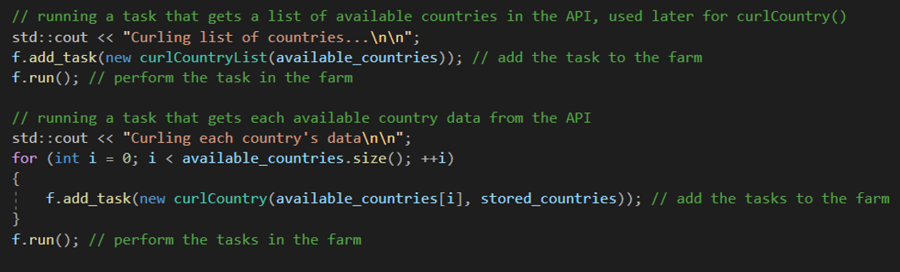
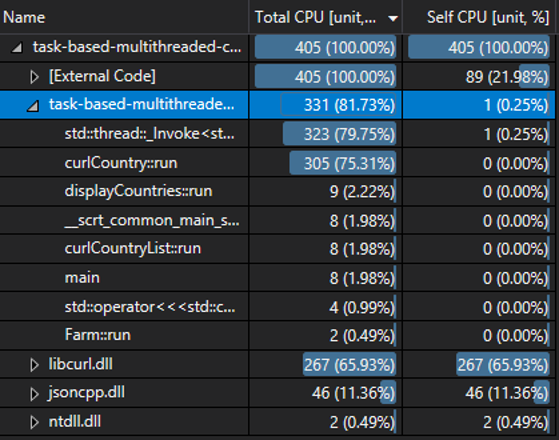
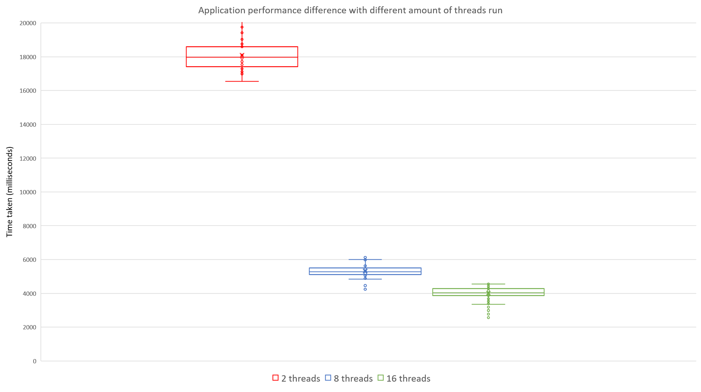

# Task-based multithreaded cURL application for transferring COVID-19 Coronavirus statistics


*Note: This was a university project.*


Basically, we were asked to make a multithreaded application by choosing a specific design pattern depending on the application. I've used open source libcurl (https://github.com/curl/curl) and json parser (https://github.com/open-source-parsers/jsoncpp) libraries to get COVID-19 statistics of each country worldwide. My goal was to get countries’ number of confirmed cases and deaths caused by COVID-19 efficiently, hence I've implemented multithreaded task-based parallelism system. I've also made a presentation where I explained why I did things the way I did with arguments and boxplots. 

I've implemented task-based parallelism and used a farming pattern because of the nature of my application. In the application, I run multiple data requests to a database which can be easily parallelised using a task-based system. The farming pattern is a useful pattern to use when there is a problem that can be broken into lots of parts and have no data dependencies between them, therefore the farming pattern fits my project very well. Also, the load balancing of the application is improved, and the worker threads can be long-running instead of destroying the threads after each task which is costly.

Anyways, I've encountered a few data dependency situations when solving the problem. For instance, I had to get a list of available countries in the database before sending multithreaded requests of data for each country.



*^get a list of available countries in the database before sending multithreaded requests of data for each country*

As expected, single threaded tasks like these took less than 10% of the application runtime, including functions such as main.



*^single threaded tasks like these took less than 10% of the application runtime*

However, during multiple performance profilings, the application ran significantly faster when multithreaded i.e. despite a few data dependencies, the speed performance of the application is directly proportional to the number of ran threads. Also, the implemented number of threads was inversely proportional to the time spent solving the problem, which is expected as the multithreaded tasks are solved quicker with multiple threads. 



### Installing libraries

You can download and install JsonCpp using the vcpkg dependency manager:
```
git clone https://github.com/Microsoft/vcpkg.git
cd vcpkg
./bootstrap-vcpkg.sh
./vcpkg integrate install
./vcpkg install jsoncpp
```

You can download and install curl using the vcpkg dependency manager:

```
git clone https://github.com/Microsoft/vcpkg.git
cd vcpkg
./bootstrap-vcpkg.sh
./vcpkg integrate install
./vcpkg install curl
```

Alternative installation methods are provided in the provided GitHub repositories:
libcurl (https://github.com/curl/curl)
JsonCpp (https://github.com/open-source-parsers/jsoncpp)

## Authors
**Titas Saunorius** (1800284@uad.ac.uk) [titus-sec](https://github.com/titus-sec)
Abertay University
CMP 202 Data Structures and Algorithms 2

## Acknowledgments

API used: “Coronavirus COVID19 API” (https://covid19api.com; 
API documentation: https://documenter.getpostman.com/view/10808728/SzS8rjbc)

Libraries used (alternative installation methods are provided in the provided GitHub repositories):
libcurl (https://curl.haxx.se/ ; GitHub repo: https://github.com/curl/curl)
JsonCpp (GitHub repo: https://github.com/open-source-parsers/jsoncpp)
